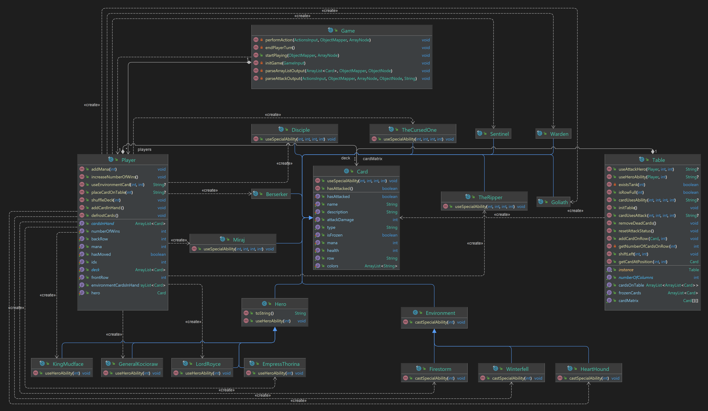

## OOP Homework 2022-2023 (GwentStone)

### Design details
* The main idea of this homework was to implement the mechanics of a game that is similar
with Hearthstone or Gwent. My design idea consists of creating a generic class **`Card`** that will
be inherited by each specific card (`Minions`, `Environment` or `Heroes`). This thing enables a 
modular setup, where functionality can be easily added in the future. Therefore, each card
type is customizable and can support modifications without affecting the other cards or
a new card can be easily created using the template defined in the class.

* Also, I created a class that implements the player's profile. The game consists of
two players that perform their actions in turns. Each player has a deck that is specified
at the input and is shuffled at the beginning of every game. The players receive a card
from the deck when the game starts and when a round ends. To implement this, I created
a deep copy of each deck and an array list for the cards that a player has in hand, thus avoiding the need to modify
the data received as input. The player class also has some helpful members, for example
the **frontRow**, the **backRow** or the **hasMoved** property that I used to simplify the implementation.

* The game is played on a table that I chose to represent as a 4 x 5 matrix that has the type **`Card`**. The table 
is a shared entity between the classes in this project, so I used the Singleton pattern for 
it because it avoids a global declaration and multiple instances of the same class. Also, all the
methods that implement the actions involving the cards of the players are defined inside this
`Table` object, providing flexibility when calling them.

* Finally, I created a class **`Game`** that connects the received input with all the things described
earlier. Here, I initialized the setup for each game and implemented a parser to be able to execute
the received commands. The method **`performAction()`** provides this functionality, writing data to the
output according to each situation. You can take a look at the diagram below to better understand
the relations between the classes that I defined to make this project.

### Conclusions
It was a nice project that helped me understand the basics of the Object-Oriented Programming paradigm. After I have successfully finished it, I can say that I am more familiar with concepts like class inheritance, overriding, overloading, encapsulation, etc.
